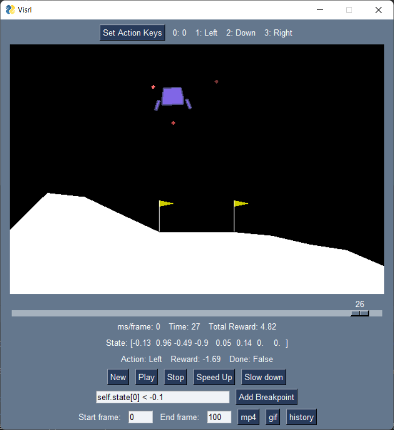

# Visrl
Visrl (pronounced "visceral") is a simple wrapper to analyse and visualise reinforcement learning agents' behaviour in the environment.



Reinforcement learning requires a lot of overhead code to inspect an agent's behaviour visually, typically through `env.render()`. Visrl allows users to easily intervene and switch between agent control and human control, and allows inserting a breakpoint in the game state to pause only at a relevant state of interest.

## Features
- Set action hotkeys
- Human intervention: Take actions 1 step at a time
- Agent control: Return control to the agent
- Speed up/ slow down frame rate
- Visualise relevant values across history
- Breakpoint: Run until a condition involving values is fulfilled
- Playback: Show past frames and ations
- Record: Record a .mp4, .gif or download a .csv of the history.

## Install
```python
pip install visrl
```

## Usage
```python
import gym
from stable_baselines3 import DQN
from visrl import Visrl

env = gym.make('LunarLander-v2')
agent = DQN('MlpPolicy', env, verbose=1)
agent.learn(total_timesteps=int(2e5))

Visrl(env, agent).run()
```
